<table align="center"><tr><td align="center" width="9999">

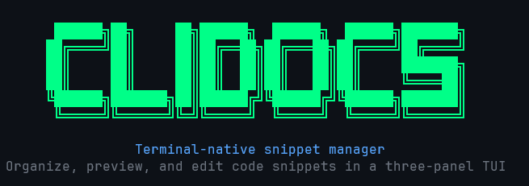

**A terminal-native snippet manager built with Go**

[](https://go.dev)
[](https://www.microsoft.com/windows)
[](https://learn.microsoft.com/powershell)
[](https://neovim.io)

</td></tr></table>

---

## Table of Contents

- [Features](#features)
- [Requirements](#requirements)
- [Installation](#installation)
- [Usage](#usage)
- [Splash Screen](#splash-screen)
- [Interface](#interface)
- [Keyboard Shortcuts](#keyboard-shortcuts)
- [Folder Management](#folder-management)
- [Subfolder Navigation](#subfolder-navigation)
- [Folder Search](#folder-search)
- [Snippets Management](#snippets-management)
- [Preview Panel](#preview-panel)
- [Folder Favorites](#folder-favorites)
- [Snippets Directory](#snippets-directory)
- [Neovim Integration](#neovim-integration)
- [File Import](#file-import)
- [GitHub Sync](#github-sync)
- [Console Easter Egg](#console-easter-egg)
- [Supported Languages](#supported-languages)
- [Project Structure](#project-structure)
- [Dependencies](#dependencies)

---

## Features

<details>
<summary><strong>Click to expand full feature list</strong></summary>

[](.)
[](.)
[](.)
[](.)
[](.)

- **Three-panel layout** — Folders / Snippets / Preview, fully keyboard-driven
- **Splash screen** — ASCII art welcome screen when launching without a CLI argument; choose default dir or browse for another
- **Subfolder navigation** — folders with subfolders show a `›` indicator; press `Enter` to enter **parent-view mode** — the Folders panel shows `~/` (direct snippets of the parent) plus each subfolder; navigate with `↑↓` and press `Enter` on a subfolder to dive deeper; press `←` to go back
- **Create subfolders** — press `N` in the Folders panel to create a subfolder inside the selected folder
- **Folder search** — press `/` in the Folders panel to filter folders by name in real-time
- **Rename folders** — press `R` in the Folders panel to rename any folder inline
- **Delete folders** — press `D` in the Folders panel to delete a folder and all its contents (with confirmation)
- **Rename snippets** — press `r` in the Snippets panel to rename the selected file
- **Syntax highlighting** powered by [Chroma](https://github.com/alecthomas/chroma) with the GitHub Dark theme
- **Language badges** — each file shows its extension label in the official language color
- **Full file path** — the Preview panel shows the complete absolute path in orange below the file title
- **Open in Neovim or VS Code** — press `e` (Neovim) or `v` (VS Code) from anywhere to open the previewed file
- **Open file location** — press `o` in the Preview panel to open the file's folder in Windows Explorer
- **Virtual scroll** — Folders and Snippets panels scroll smoothly; cursor always stays visible
- **Folder favorites** — press `f` to favorite/unfavorite; press `F` for the Favorites jump modal
- **Return to home directory** — press `H` to return to the original snippets directory
- **Copy preview to clipboard** — press `c` in Preview to copy the entire file content
- **Inline file search** — press `/` in Snippets to filter files by name in real-time
- **Preview word search** — press `/` in Preview to search for any word; type freely including `n`; `n`/`N` cycle hits only after `Enter`
- **Line numbers** — toggle with `L`; matched search lines highlighted in orange / green
- **Modern folder picker** — uses Windows Explorer-style `IFileOpenDialog` when changing directory
- **Contextual status bar** — hints update automatically based on active panel
- **File import** — native Windows multi-select file picker
- **Delete with confirmation** — press `d` to delete a snippet safely
- **Move between folders** — press `m` to move a snippet to another folder
- **GitHub sync** — push your snippets to a remote repository with a single key press
- **TUI Installer** — `clidocs-install.exe` adds `clidocs` to PATH automatically
- **CLI directory argument** — run `clidocs`, `clidocs .`, or `clidocs <path>` to open any directory
- **Console easter egg** — press `:` from any panel to open the `Cmdline` console with commands: `time`, `whoami`, `nvim`, `help`, `clear`
- **Work hours calculator** — `time` command computes coffee break, lunch, normal exit and max exit times
- **Neovim quick reference** — `nvim` console command opens a two-column cheat-sheet with navigation, editing, save/quit, search, and multi-line comment/uncomment instructions
- **Error modal word-wrap** — long error messages are automatically broken into multiple lines so they never overflow the terminal width
- **Preview line truncation** — lines longer than the panel width are hard-truncated with ANSI-safe clipping, preventing long files from breaking the TUI layout
- **Preview panel full-width** — markdown and code previews now use the full available panel width at any terminal size
- **Dark theme** — unified `#0d1117` background, GitHub-inspired palette

</details>

---

## Requirements

| Requirement | Notes |
|---|---|
| **Go 1.24+** | To build from source |
| **Windows 11 + PowerShell** | Primary supported platform |
| **Neovim (`nvim`)** | Must be in `PATH` to edit files with `e` |
| **VS Code (`code`)** | Must be in `PATH` to open files with `v` |
| **Windows Terminal (`wt`)** | Recommended — editor opens in a new tab |
| **Git** | Required for the GitHub sync feature |
| **JetBrains Nerd Font** (or any Nerd Font) | For folder icons (``) in the terminal |

---

## Installation

```powershell
# Clone the repository
git clone https://github.com/your-username/clidocs.git
cd clidocs

# Build
go build -o clidocs.exe .

# Run
.\clidocs.exe

# Install globally into the computer
.\clidocs-install.exe

```

### How to install globally into the windows

> Run `.\clidocs-install.exe` as administrator

<table align="center"><tr><td align="center" width="9999">
   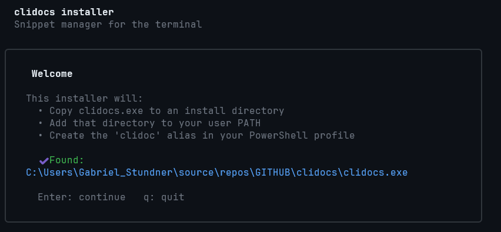
</td></tr></table>

> Select the installation path and click "Next"

<table align="center"><tr><td align="center" width="9999">
    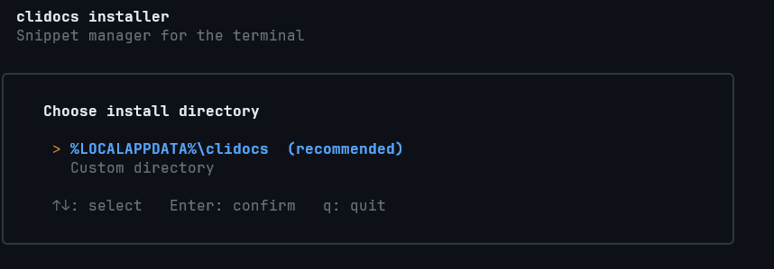
</td></tr></table>

> If there's already an .exe in the location (to update), it will ask if you want to replace it.

<table align="center"><tr><td align="center" width="9999">
   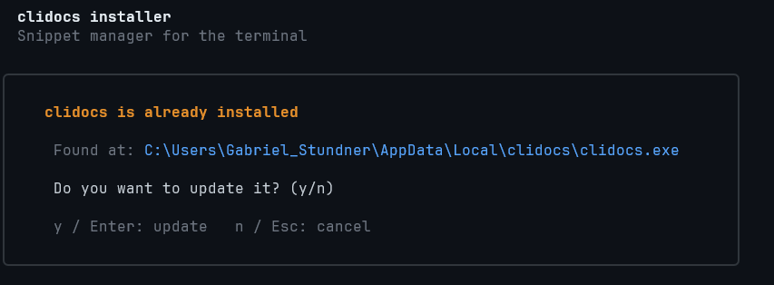
</td></tr></table>

> After change there's a success

<table align="center"><tr><td align="center" width="9999">
   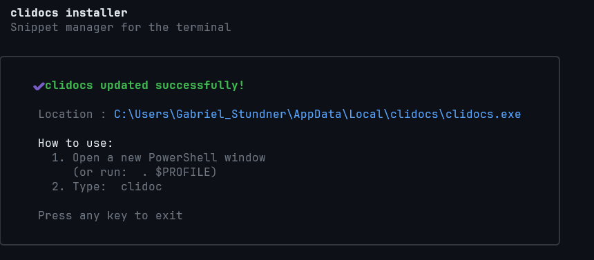
</td></tr></table>

After that, open any PowerShell window and type `clidocs`.

> **Snippets are stored in:** `%USERPROFILE%\clidocs_snippets\`  
> The directory is created automatically on first run. Each sub-folder becomes a category in the Folders panel.

---

## Usage

```powershell
# Open default snippets directory (~\clidocs_snippets)
clidocs

# Open the current working directory as snippets root
clidocs .

# Open a specific directory
clidocs C:\Users\You\my-snippets
clidocs .\docs\snippets
```

---

## Splash Screen

When you run `clidocs` **without any arguments**, an ASCII art welcome screen is shown:

<table align="center"><tr><td align="center" width="9999">
   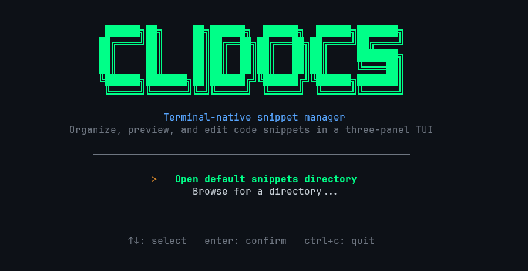
</td></tr></table>

> The splash screen is **skipped** when you pass a path argument: `clidocs .` or `clidocs <path>`.
---

## Interface

<table align="center"><tr><td align="center" width="9999">
   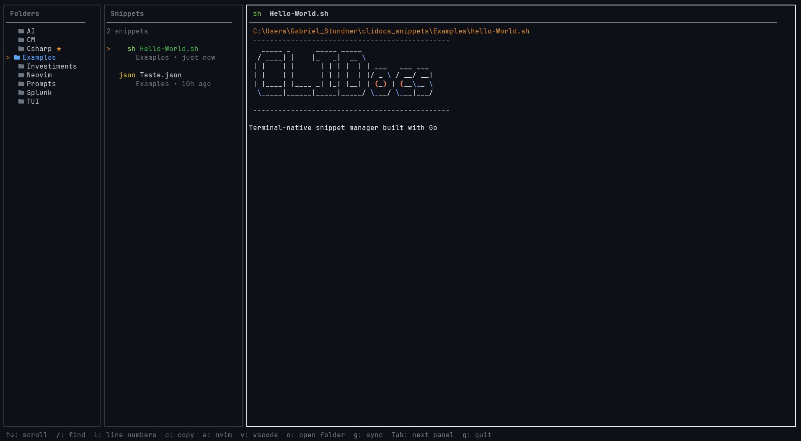
</td></tr></table>

### Panel descriptions

| Panel | Description |
|---|---|
| **Folders** | Categories for your snippets. Selected folder shown in blue with `>` arrow. Folders with subfolders show a `›` indicator. Press `←` to go back when inside a subfolder. |
| **Snippets** | Files inside the selected folder. Selected file shown in green. Extension badge colored by language. |
| **Preview** | Syntax-highlighted content of the selected file. Shows full file path in orange. Scrollable. |

---

## Keyboard Shortcuts

> Click each section to expand the shortcuts for that panel.

<details>
<summary><strong>🗂️ Folders Panel</strong></summary>

| Key | Action |
|---|---|
| `↑` / `k` | Previous folder |
| `↓` / `j` | Next folder |
| `Enter` | Open folder → enters **parent-view** (shows `~/` + subfolders when folder has subfolders, otherwise navigates directly) |
| `←` | **Go back** to parent directory (when inside a subfolder) |
| `n` | Create new folder |
| `N` | Create new **subfolder** inside the selected folder |
| `/` | **Search / filter** folders by name |
| `R` | **Rename** selected folder |
| `D` | **Delete** selected folder and all its contents (confirmation required) |
| `f` | Favorite / unfavorite the selected folder |
| `F` | Open **Favorites modal** |
| `H` | Return to original snippets directory |
| `o` | Snippets directory info |
| `Tab` / `→` | Next panel |
| `q` / `Ctrl+C` | Quit |

</details>

<details>
<summary><strong>📄 Snippets Panel</strong></summary>

| Key | Action |
|---|---|
| `↑` / `k` | Previous file |
| `↓` / `j` | Next file |
| `Enter` | Open selected file in Neovim |
| `/` | **Inline search** — filter files by name |
| `n` | Create new file |
| `r` | **Rename** selected file |
| `m` | Move file to another folder |
| `c` | Import file from Windows file picker |
| `d` | Delete selected file (with confirmation) |
| `Tab` | Next panel |

</details>

<details>
<summary><strong>🔍 Snippets Inline Search Mode (<code>/</code> in Snippets)</strong></summary>

| Key | Action |
|---|---|
| Type | Filter files in real-time (supports `*.go` glob) |
| `↑` / `↓` | Navigate filtered results — preview updates live |
| `Enter` | Confirm selection, exit search |
| `Esc` | Cancel search, restore full list |

</details>

<details>
<summary><strong>👁️ Preview Panel</strong></summary>

| Key | Action |
|---|---|
| `↑` / `k` | Scroll up |
| `↓` / `j` | Scroll down |
| `L` | Toggle line numbers |
| `/` | **Word search** in current file |
| `c` | **Copy** entire file content to clipboard |
| `e` | Open file in **Neovim** |
| `v` | Open file in **VS Code** |
| `o` | Open file's **folder in Explorer** |
| `Tab` | Next panel |
| `q` / `Ctrl+C` | Quit |

</details>

<details>
<summary><strong>🔎 Preview Word Search Mode (<code>/</code> in Preview)</strong></summary>

| Key | Action |
|---|---|
| Type (any key) | Appends to search query — **including `n`** |
| `Enter` | Find all matches — matched lines highlighted |
| `n` | Jump to **next** match (only after `Enter` has been pressed) |
| `N` | Jump to **previous** match (only after `Enter` has been pressed) |
| `Esc` | Close search |

</details>

<details>
<summary><strong>📁 Subfolder Navigator Modal</strong></summary>

| Key | Action |
|---|---|
| `↑` / `k` | Previous entry |
| `↓` / `j` | Next entry |
| `Enter` on **directory** | **Set as Folders panel root** — browse its contents directly |
| `Enter` on **file** | Load file in Preview panel |
| `Backspace` | Go up one level (or close modal if at root) |
| `Esc` | Close modal |

</details>

<details>
<summary><strong>🌐 Global Keys</strong></summary>

| Key | Action |
|---|---|
| `Tab` / `→` / `←` | Switch panels |
| `s` | Jump to Folders panel |
| `g` | Sync to GitHub |
| `G` | Edit GitHub config |
| `o` | Snippets directory info (non-Preview panels) |
| `:` | Open **Console** easter egg |
| `q` / `Ctrl+C` | Quit |

</details>

<details>
<summary><strong>🖥️ Console (easter egg — press <code>:</code>)</strong></summary>

| Command | Action |
|---|---|
| `time` | Work hours calculator — enter start time, get exit times |
| `whoami` | Show custom user info |
| `nvim` | **Neovim Quick Reference** — two-column cheat-sheet with all basic commands |
| `help` | Show all shortcuts and commands |
| `clear` | Clear console output |
| `exit` / `q` | Close console |

</details>

---

## Folder Management

### Create a folder

1. Focus the **Folders** panel
2. Press `n` → type the folder name → `Enter` to confirm, `Esc` to cancel

<table align="center"><tr><td align="center" width="9999">
   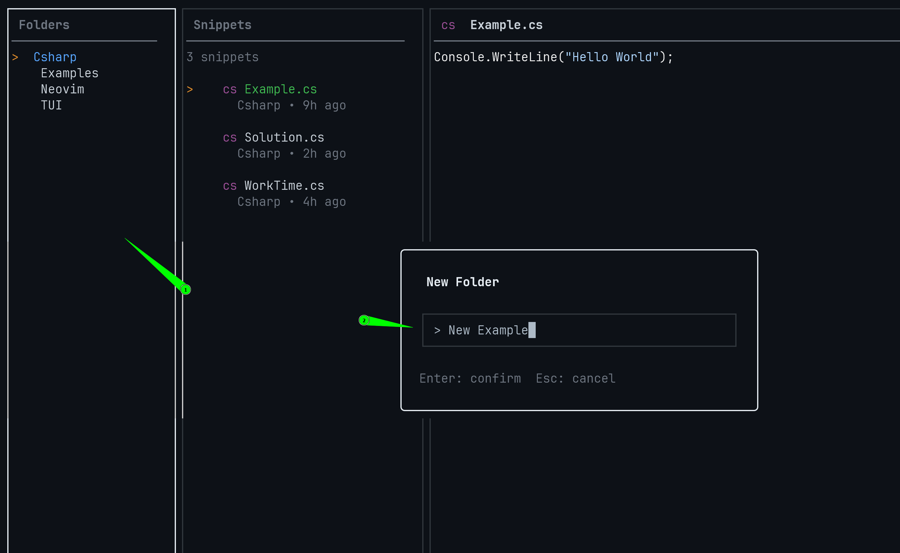
</td></tr></table>

### Rename a folder

1. Focus the **Folders** panel and navigate to the folder
2. Press `R` — a modal appears with the current name pre-filled
3. Edit the name → `Enter` to confirm, `Esc` to cancel
4. Favorites referencing the folder are updated automatically

<table align="center"><tr><td align="center" width="9999">
   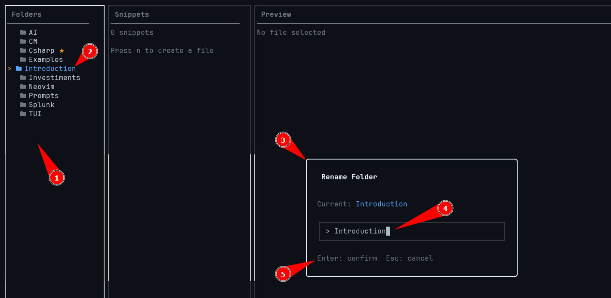
</td></tr></table>

### Delete a folder

1. Focus the **Folders** panel and navigate to the folder
2. Press `D` — a confirmation modal appears
3. Press `Enter` or `y` to delete, `Esc` or `n` to cancel

> **Warning:** Deletion is permanent and recursive — all files and subfolders inside are removed from disk.

<table align="center"><tr><td align="center" width="9999">
   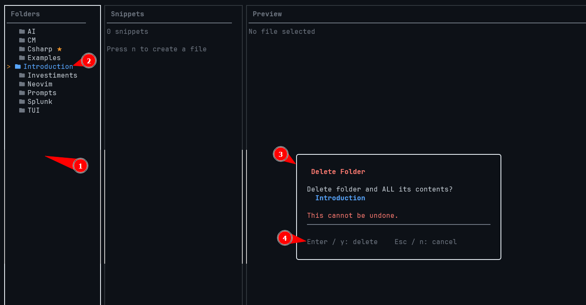
</td></tr></table>

---

## Subfolder Navigation

Folders that contain subfolders display a `›` indicator next to their name.

<table align="center"><tr><td align="center" width="9999">
   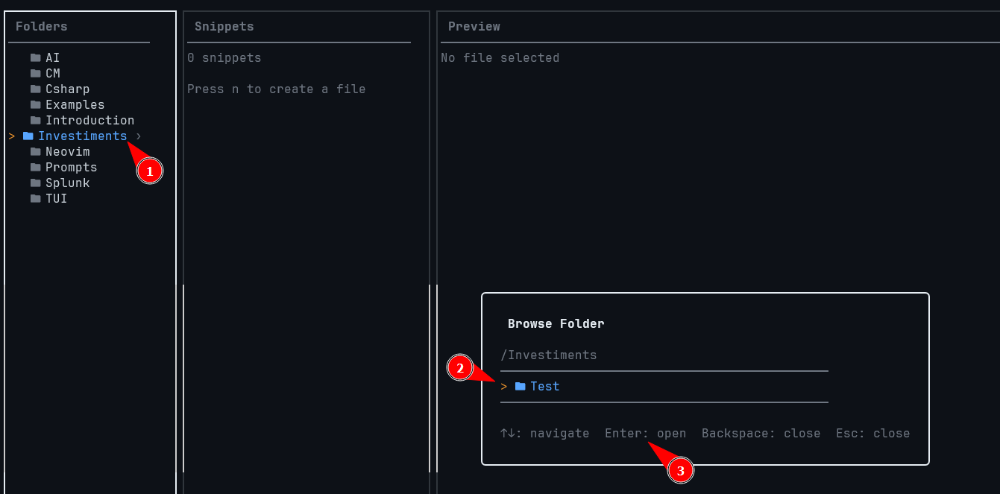
</td></tr></table>

### Browsing subfolders

1. Navigate to a folder with the `›` marker in the Folders panel
2. The Snippet panel already shows the **direct snippets** of that folder
3. Press `Enter` — the app enters **parent-view mode**:
   - The Folders panel title changes to the folder name + `← back`
   - The first row is `~/` — selecting it shows the folder's own snippets
   - Each subsequent row is a subfolder — selecting it shows its snippets
4. Press `Enter` on a **subfolder row**:
   - If it has no sub-subfolders → navigates directly into it
   - If it also has children → enters parent-view recursively
5. Press `←` to exit parent-view and return to the previous level

<table align="center"><tr><td align="center" width="9999">
   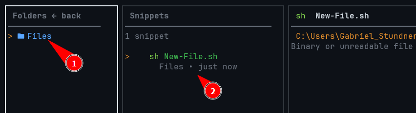
</td></tr></table>

### Going back up

When inside parent-view or a nested subfolder, the Folders panel title shows **`← back`**.  
Press `←` (left arrow) on the **Folders panel** to go back to the previous level.

### Creating a subfolder

1. Navigate to any folder in the Folders panel
2. Press `N` — a modal asks for the new subfolder name
3. Press `Enter` to create, `Esc` to cancel

<table align="center"><tr><td align="center" width="9999">
   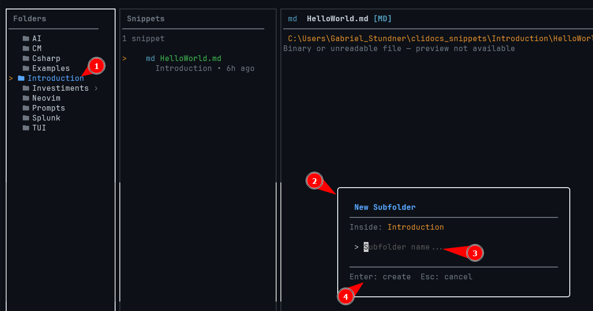
</td></tr></table>

---

## Folder Search

1. Focus the **Folders** panel
2. Press `/` — the title bar changes to `/ query█`
3. Type to filter — only folders matching the query are shown
4. Use `↑`/`↓` to navigate filtered results
5. Press `Enter` to confirm selection and switch to that folder's snippets
6. Press `Esc` to cancel and restore the full list

<table align="center"><tr><td align="center" width="9999">
   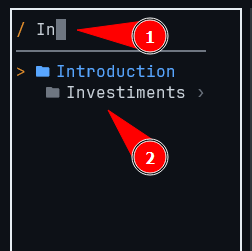
</td></tr></table>

---

## Snippets Management

### Create a file

1. Focus the **Snippets** panel (with a folder selected)
2. Press `n`
3. **Step 1** — Enter the file name (without extension) → `Enter` or `Tab`
4. **Step 2** — Enter the extension (e.g. `go`, `py`, `md`) → `Enter` to create and open

<table align="center"><tr><td align="center" width="9999">
   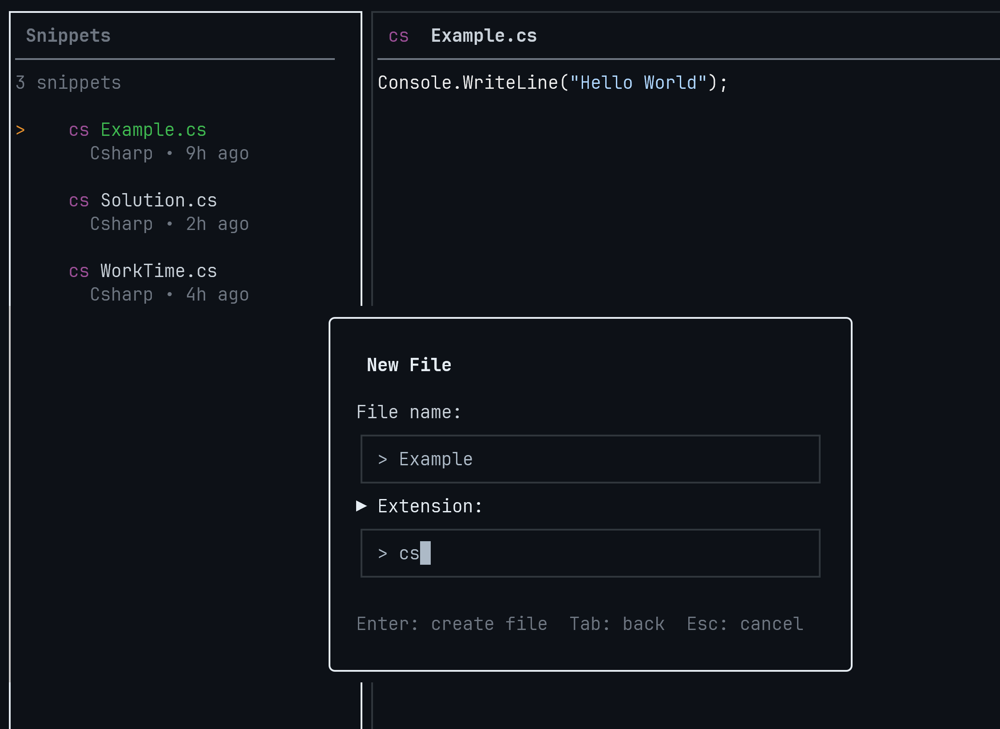
</td></tr></table>


### Rename a snippet

1. Focus the **Snippets** panel and navigate to the file
2. Press `r` — a modal appears with the current filename pre-filled
3. Edit the name → `Enter` to confirm, `Esc` to cancel

<table align="center"><tr><td align="center" width="9999">
   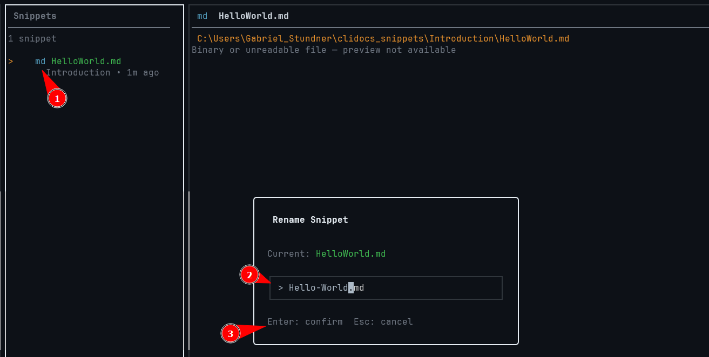
</td></tr></table>

### Delete a file

1. Focus the **Snippets** panel and navigate to the file
2. Press `d` — a confirmation modal shows the filename
3. Press `Enter` or `y` to delete, `Esc` or `n` to cancel

> **Warning:** Deletion is permanent.

<table align="center"><tr><td align="center" width="9999">
   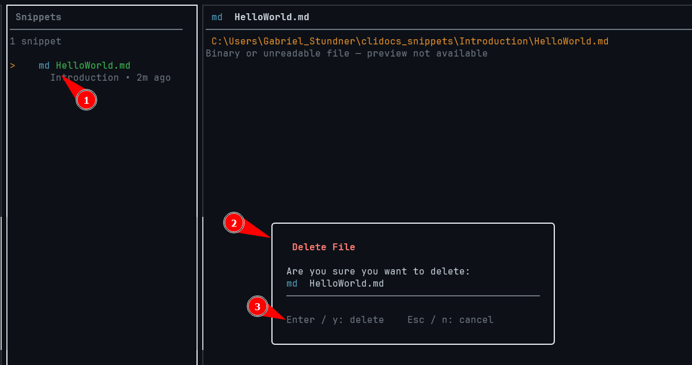
</td></tr></table>

### Move a file to another folder

1. Focus the **Snippets** panel and navigate to the file
2. Press `m` (requires at least 2 folders)
3. A modal lists all other folders — navigate with `↑↓`
4. Press `Enter` to move the file

<table align="center"><tr><td align="center" width="9999">
   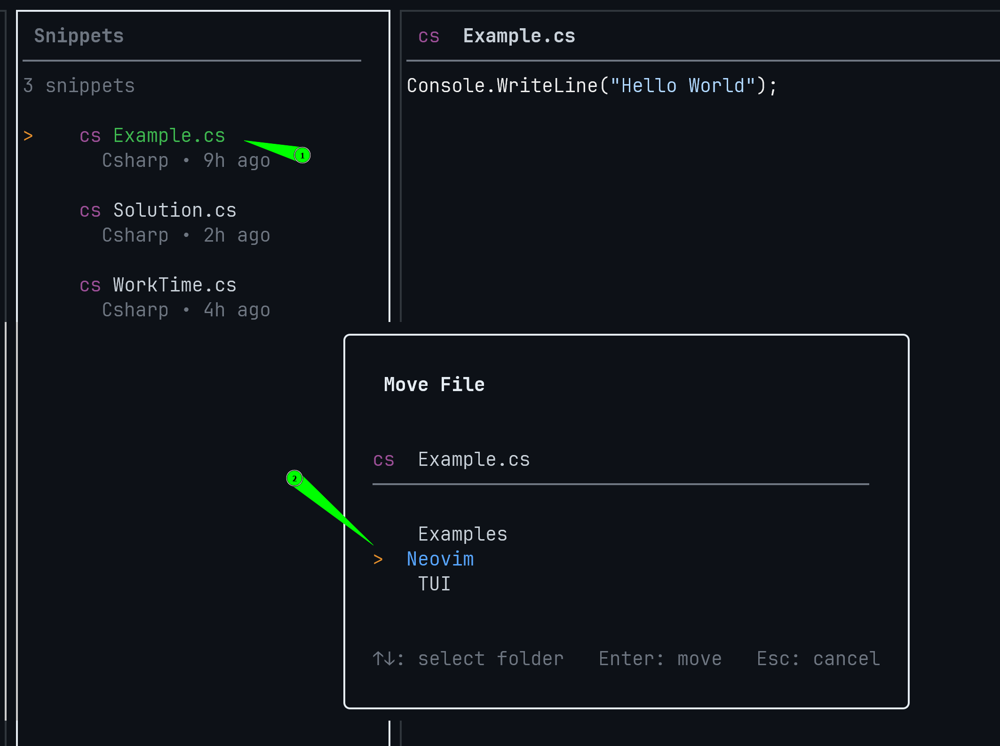
</td></tr></table>

### Inline File Search

1. Focus the **Snippets** panel
2. Press `/` — the title bar changes to a search input `/ query█`
3. Type to filter — matches update instantly (`*.go`, `docker`, `main.go`)
4. Use `↑`/`↓` to navigate filtered results — **preview updates live**
5. Press `Enter` to confirm selection, `Esc` to cancel

<table align="center"><tr><td align="center" width="9999">
   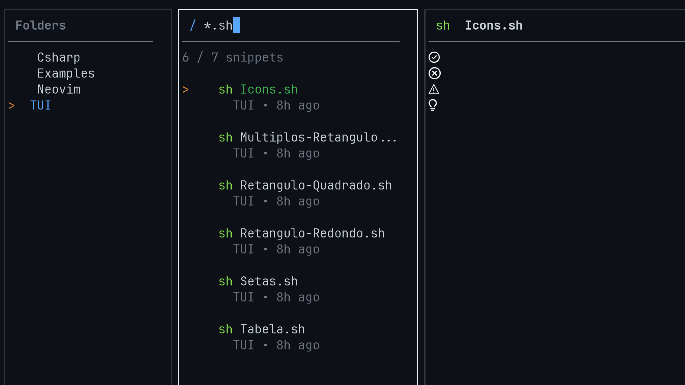
</td></tr></table>

---

## Preview Panel

The Preview panel shows the syntax-highlighted content of the selected file with additional information and actions.

### File path indicator

When a file is loaded — either from the Snippets panel or via the Subfolder Navigator — the **full absolute path** is displayed in orange below the file title:

<table align="center"><tr><td align="center" width="9999">
   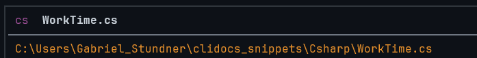
</td></tr></table>

### Open actions

| Key | Action |
|---|---|
| `e` | Open file in **Neovim** (new Windows Terminal window) |
| `v` | Open file in **VS Code** (`code <path>`) |
| `o` | Open the file's **containing folder** in Windows Explorer |

### Word Search

1. Press `/` — a search bar appears below the file title
2. Type the word or phrase you want to find
3. Press `Enter` — all matching lines are highlighted:
   - **Orange `▶`** — current hit
   - **Green `•`** — other matches
4. Press `n` / `N` to cycle through hits
5. Press `Esc` to close

<table align="center"><tr><td align="center" width="9999">
   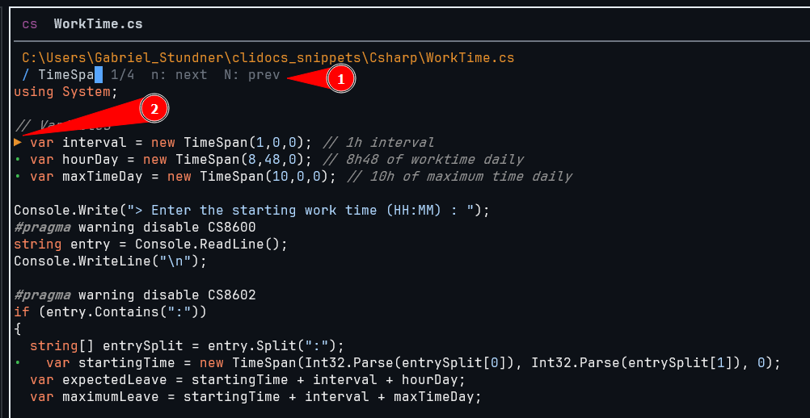
</td></tr></table>

### Line Numbers

Press `L` to toggle line numbers. When active, matched search lines show their number in orange (current) or green (other hits).

<table align="center"><tr><td align="center" width="9999">
   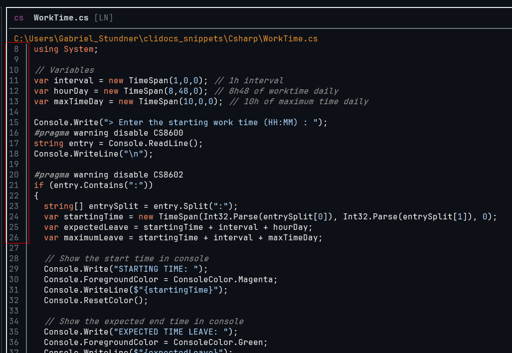
</td></tr></table>

### Markdown Preview

Files with a `.md` or `.markdown` extension are rendered using **[glamour](https://github.com/charmbracelet/glamour)** — the same GitHub Dark style used in terminal markdown viewers:

| Markdown | Rendered as |
|---|---|
| `# Heading` | Bold colored heading |
| `**bold**` | **Bold** text |
| `*italic*` | *Italic* text |
| `` `code` `` | Inline code block |
| ` ```go ` fenced block | Syntax-highlighted code |
| `- list item` | Bulleted list |
| `> blockquote` | Quoted block |
| `[link](url)` | Styled link |
| `---` | Horizontal rule |

A **`[MD]`** badge appears in the preview panel title when a markdown file is active.

> **Note:** LaTeX math formulas (`$x^2$`, `$$\int$$`) are not rendered — the terminal has no math engine. Write formulas as ASCII (`x²`) or use fenced code blocks (` ```math `).

<table align="center"><tr><td align="center" width="9999">
   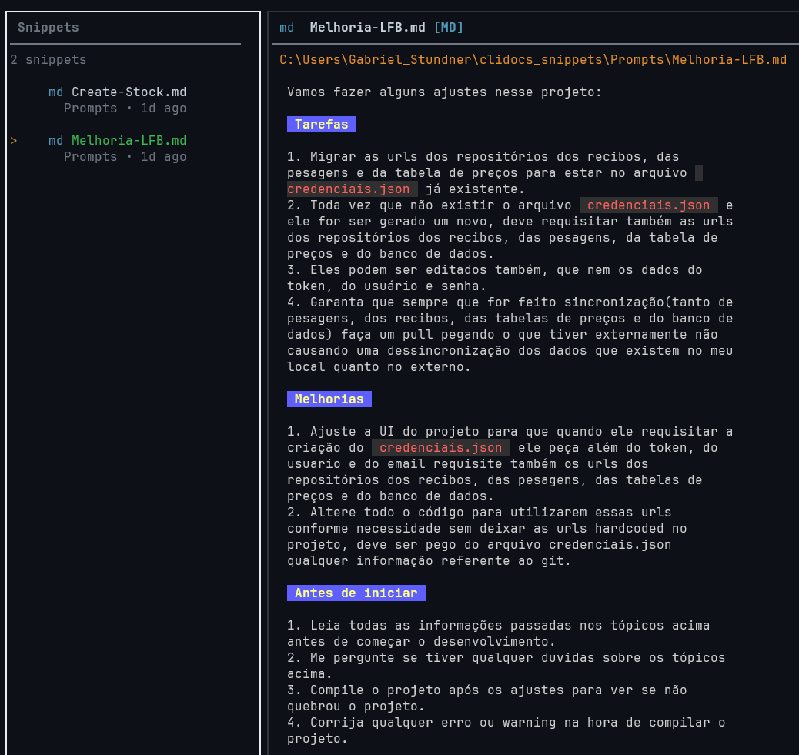
</td></tr></table>

### Copy to clipboard

Press `c` in the Preview panel to copy the entire file content to the system clipboard. A green status message confirms the action.

<table align="center"><tr><td align="center" width="9999">
   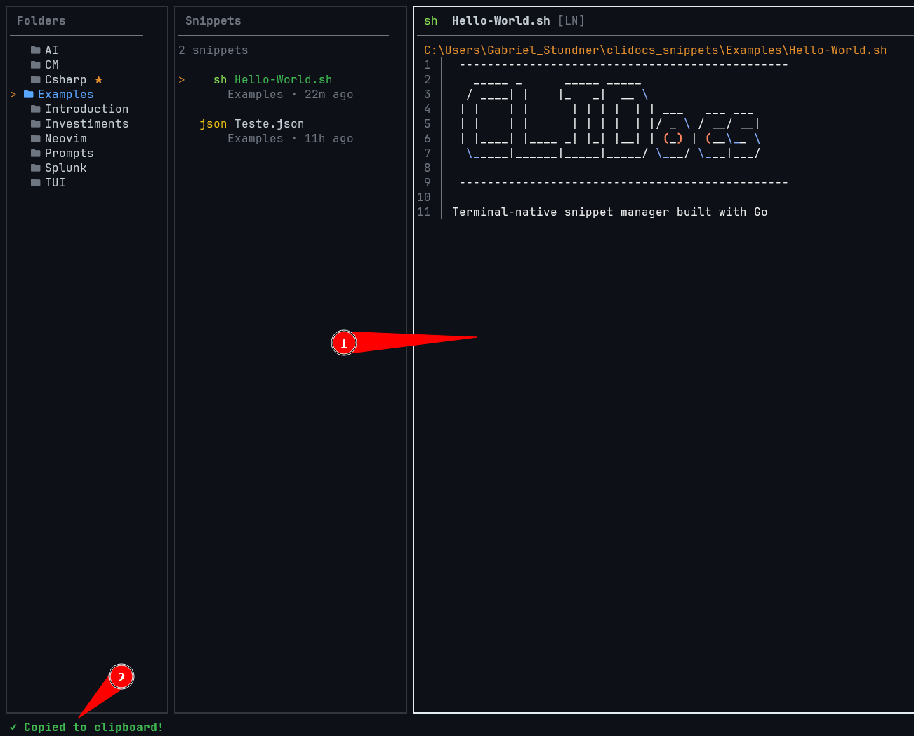
</td></tr></table>

---

## Folder Favorites

Favorites let you bookmark frequently-used folders and jump to them instantly.

### Marking a favorite

1. Focus the **Folders** panel and select any folder
2. Press `f` — the folder gets a `★` indicator; a green status message confirms
3. Press `f` again to unfavorite

> Favorites are saved to `.clidocs_favorites.json` inside the snippets directory and persist across sessions.

<table align="center"><tr><td align="center" width="9999">
   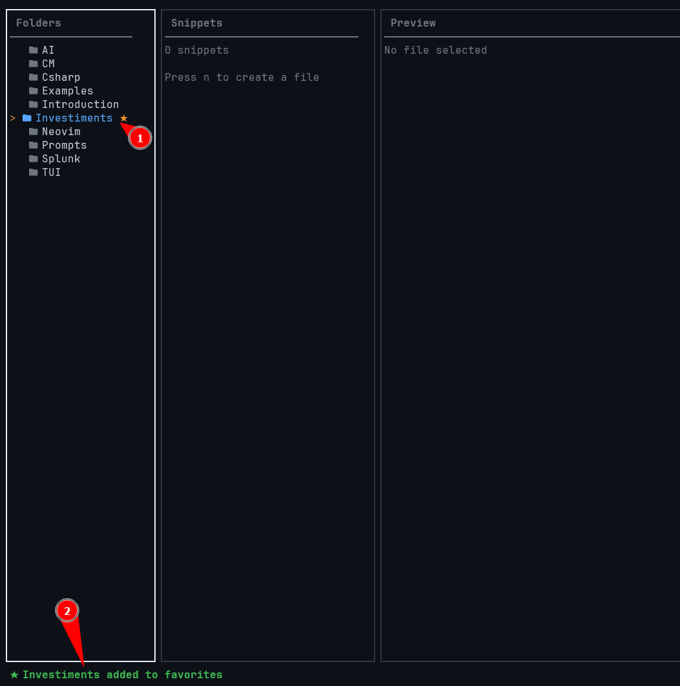
</td></tr></table>

### Navigating favorites

1. Press `F` (uppercase) in the **Folders** panel to open the **Favorites modal**
2. Use `↑`/`↓` to navigate → `Enter` to jump to that folder
3. Press `f` inside the modal to unfavorite the selected entry
4. Press `Esc` or `F` to close

<table align="center"><tr><td align="center" width="9999">
   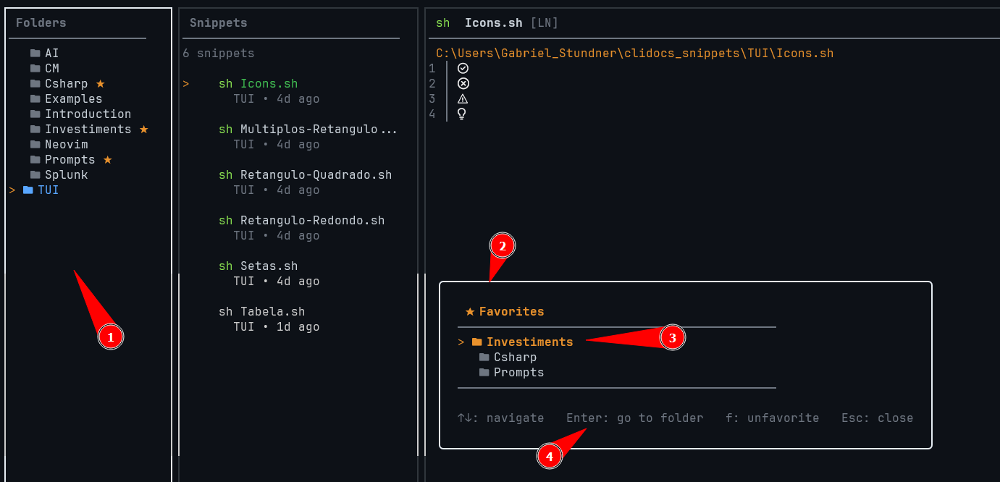
</td></tr></table>

### Returning to the home directory

If you changed the snippets directory, the Folders panel title shows **`H:home`**.  
Press `H` to instantly return to the original snippets directory.

---

## Snippets Directory

Press `o` (on Folders or Snippets panel) to open the directory info modal.

| Action | Description |
|---|---|
| `Enter` | Opens the snippets folder in Windows Explorer |
| `s` | Opens a modern **Windows Explorer-style folder picker** to choose a new directory |
| `Esc` | Closes the modal |

> Changing the directory takes effect immediately. The original default directory (`%USERPROFILE%\clidocs_snippets`) is never deleted.

<table align="center"><tr><td align="center" width="9999">
   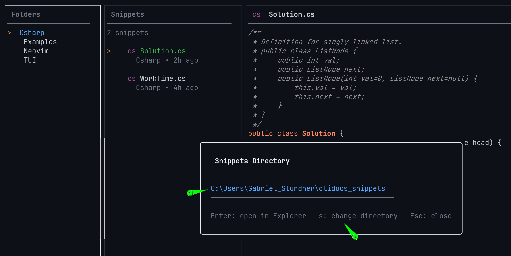
</td></tr></table>

---

## Neovim Integration

When you press `Enter` on a file in the Snippets panel (or `e` in the Preview panel), clidocs opens **Neovim in a new Windows Terminal window**:

<table align="center"><tr><td align="center" width="9999">
   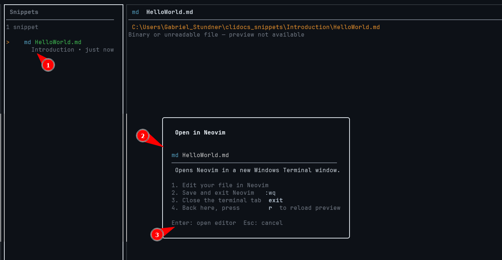
</td></tr></table>

> **Fallback:** If Windows Terminal (`wt`) is not available, Neovim takes over the current terminal.

---

## File Import

Copy any file from your computer into the currently selected folder:

1. Focus the **Snippets** panel
2. Press `c`
3. A native Windows **Open File dialog** appears
4. Select one or more files → click Open

> Supports **multi-selection** — hold `Ctrl` or `Shift` in the dialog.

<table align="center"><tr><td align="center" width="9999">
   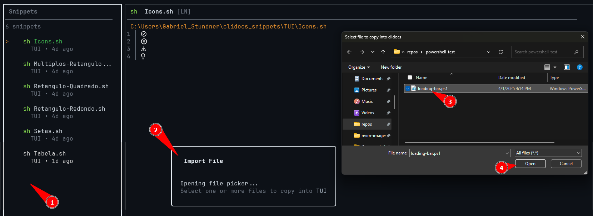
</td></tr></table>

---

## GitHub Sync

Back up and share your snippets by syncing to a GitHub repository.

<table align="center"><tr><td align="center" width="9999">
   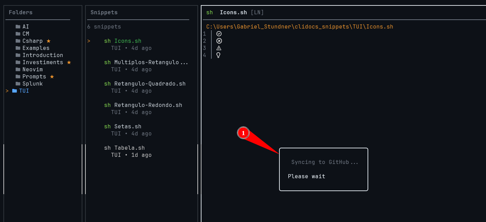
</td></tr></table>

### First use

Press `g` — a setup modal appears:

| Field | Example |
|---|---|
| **Repository URL** | `https://github.com/user/snippets.git` |
| **Username** | `your-github-username` |
| **Email** | `you@example.com` |

Navigate fields with `Enter` or `Tab` / `Shift+Tab`. Config is saved to `.clidocs_git.json`.

<table align="center"><tr><td align="center" width="9999">
   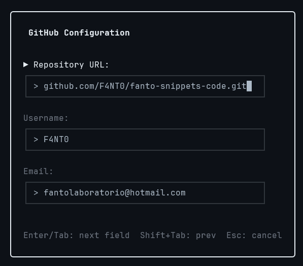
</td></tr></table>

### How sync works

1. `git init` (first time only)
2. Pulls remote changes first to avoid conflicts
3. `git add -A` → `git commit` → `git push -u origin main`
4. Shows a success or error modal

### Change configuration

Press `G` at any time to update the repo URL, username, or email.

<table align="center"><tr><td align="center" width="9999">
  
</td></tr></table>

> **Note:** The repository must exist on GitHub before syncing. For private repos, ensure credentials are cached via [Git Credential Manager](https://github.com/git-ecosystem/git-credential-manager) or SSH.

<table align="center"><tr><td align="center" width="9999">
  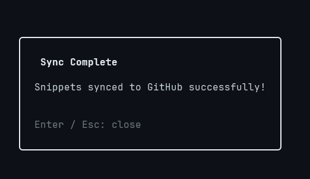
</td></tr></table>

---

## Console Easter Egg

Press `:` from **any panel** to open the `Cmdline` console — a command-line interface inside clidocs.

<table align="center"><tr><td align="center" width="9999">
  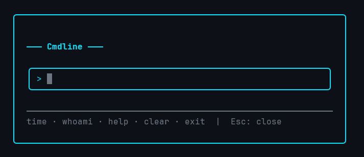
</td></tr></table>

### Available commands

| Command | Description |
|---|---|
| `time` | **Work hours calculator** — enter your start time (HH:MM) and get coffee break, lunch times, normal exit and maximum exit times |
| `whoami` | Shows your custom user info (edit the `whoamiText` constant in `console.go`) |
| `nvim` | Opens the **Neovim Quick Reference** modal — full two-column cheat-sheet for beginners |
| `help` | Displays all keyboard shortcuts and console commands |
| `clear` | Clears the console output area |
| `exit` / `quit` | Closes the console |

### Neovim Quick Reference (`nvim`)

Type `nvim` in the console and press `Enter` to open a large reference modal covering:

- **Navigation** — `hjkl`, `gg`/`G`, `Ctrl+d`/`u`, word and line jumps
- **Editing** — insert modes (`i`, `a`, `o`), undo/redo, delete, yank, paste
- **Save & Quit** — `:w`, `:q`, `:wq`, `:q!`
- **Search** — `/word`, `n`/`N` to cycle matches
- **Comment multiple lines** — `Ctrl+V` block select → `:` → `'<,'>s/^/#`
- **Uncomment multiple lines** — `Ctrl+V` block select → `:` → `'<,'>s/^#//`
- **Visual mode** — `v` (char), `V` (line), `Ctrl+V` (block)

<table align="center"><tr><td align="center" width="9999">
  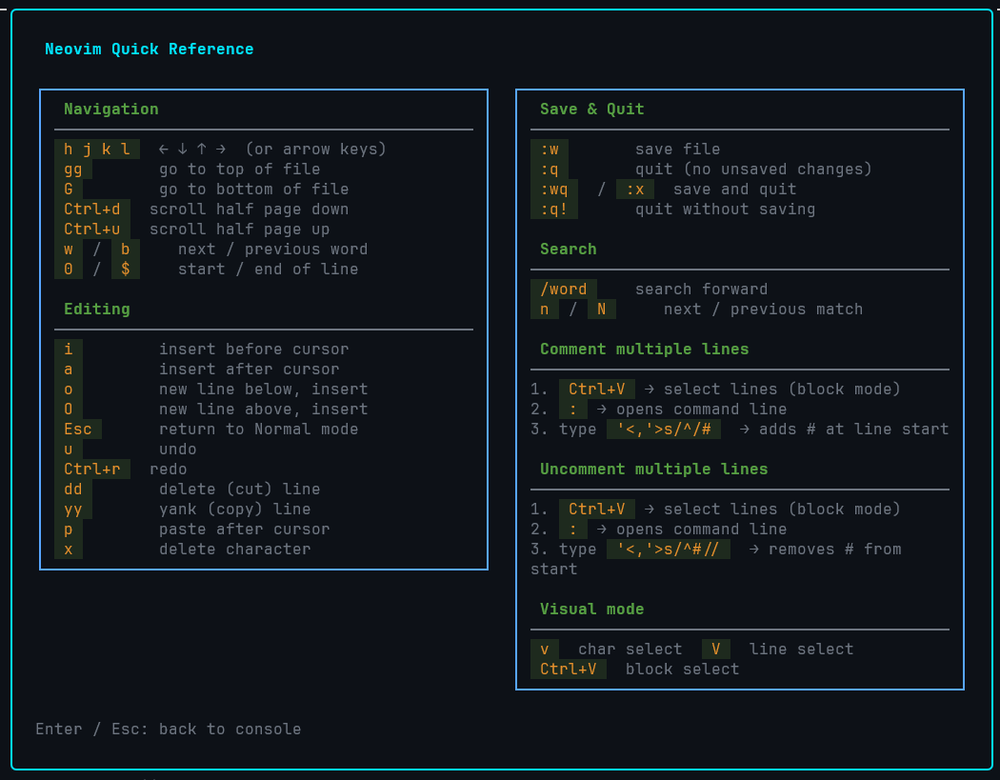
</td></tr></table>

### Work Hours Calculator (`time`)

Based on a standard workday of **8h48** (with 1h lunch), given your entry time:

| Output | Description |
|---|---|
| **Coffee break** | Suggested first break (+1h) |
| **Lunch start** | +4h after entry |
| **Lunch end** | +1h after lunch start |
| **Normal exit** | Entry + 8h48 work + 1h lunch |
| **Maximum exit** | Entry + 10h work + 1h lunch |

<table align="center"><tr><td align="center" width="9999">
  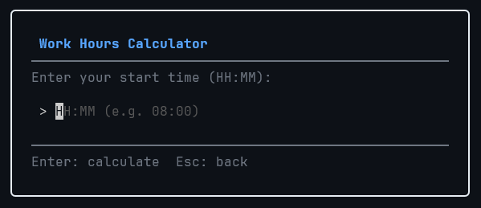
</td></tr></table>

### Customizing `whoami`

Edit `console.go` and update the `whoamiText` constant to personalize your user info:

```go
const whoamiText = `
  Your Name
  Your Role
  GitHub: github.com/yourhandle
  ...
`
```

<table align="center"><tr><td align="center" width="9999">
  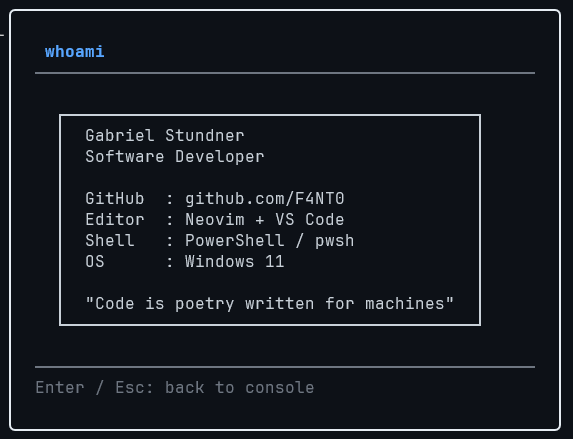
</td></tr></table>

---

## Supported Languages

Syntax highlighting uses **Chroma** with the **GitHub Dark** theme. Each file shows a colored extension badge.

| Extension | Language | Badge color |
|---|---|---|
| `.go` | Go |  |
| `.py` | Python |  |
| `.ts` | TypeScript |  |
| `.js` | JavaScript |  |
| `.tsx` / `.jsx` | React |  |
| `.rs` | Rust |  |
| `.cs` | C# |  |
| `.cpp` / `.cc` | C++ |  |
| `.c` / `.h` | C |  |
| `.java` | Java |  |
| `.kt` | Kotlin |  |
| `.swift` | Swift |  |
| `.sh` / `.bash` | Shell |  |
| `.ps1` | PowerShell |  |
| `.rb` | Ruby |  |
| `.php` | PHP |  |
| `.vue` | Vue |  |
| `.svelte` | Svelte |  |
| `.dart` | Dart |  |
| `.md` | Markdown |  |
| `.html` | HTML |  |
| `.css` | CSS |  |
| `.scss` | SCSS |  |
| `.json` | JSON |  |
| `.yaml` / `.yml` | YAML |  |
| `.toml` | TOML |  |
| `.sql` | SQL |  |
| `.xml` | XML |  |
| `.lua` | Lua |  |
| `.tf` / `.hcl` | Terraform |  |
| `.r` | R |  |
| `.ex` / `.exs` | Elixir |  |
| `.vim` | Vim Script |  |
| `.env` | Dotenv |  |
| `.txt` / `.conf` | Plain text |  |

---

## Project Structure

| File | Description |
|---|---|
| `main.go` | Entry point — splash or direct launch, creates snippets dir, starts Bubbletea |
| `splash.go` | ASCII art splash screen shown when no CLI argument is provided |
| `console.go` | `whoamiText` and `helpConsoleText` constants — edit here to customize |
| `dirs.go` | Resolves `%USERPROFILE%\clidocs_snippets` default path |
| `model.go` | App state struct, folder/file/subfolder loading, helpers |
| `update.go` | All keyboard handling, modal state machine, editor/sync launch |
| `view.go` | Three-panel layout, modal overlays, status bar renderer |
| `styles.go` | All Lipgloss styles — GitHub Dark color palette |
| `icons.go` | Extension → label + color mapping; Chroma lexer lookup |
| `highlight.go` | Chroma syntax highlighting engine |
| `gitconfig.go` | Load/save `.clidocs_git.json` configuration |
| `gitsync.go` | Git CLI operations (init, pull, add, commit, push) |
| `filecopy.go` | Modern Windows folder/file picker via PowerShell COM + file copy logic |

---

## Dependencies

| Package | Purpose |
|---|---|
| `github.com/charmbracelet/bubbletea` | TUI framework (Elm architecture) |
| `github.com/charmbracelet/bubbles` | Text input component |
| `github.com/charmbracelet/lipgloss` | Layout and styling |
| `github.com/charmbracelet/glamour` | Markdown rendering (GitHub Dark style) |
| `github.com/alecthomas/chroma/v2` | Syntax highlighting |
| `github.com/atotto/clipboard` | Clipboard write support |

### How to install de dependencies

```bash
go mod tidy
```

---

<div align="center">

Made with ☕ and Go · Dark theme · Keyboard-first

Created by Gabriel Stundner

</div>
