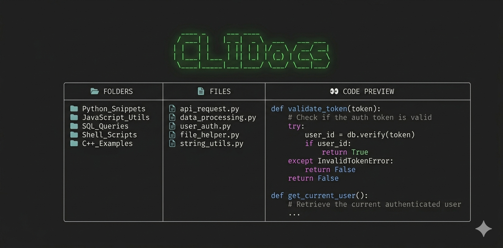
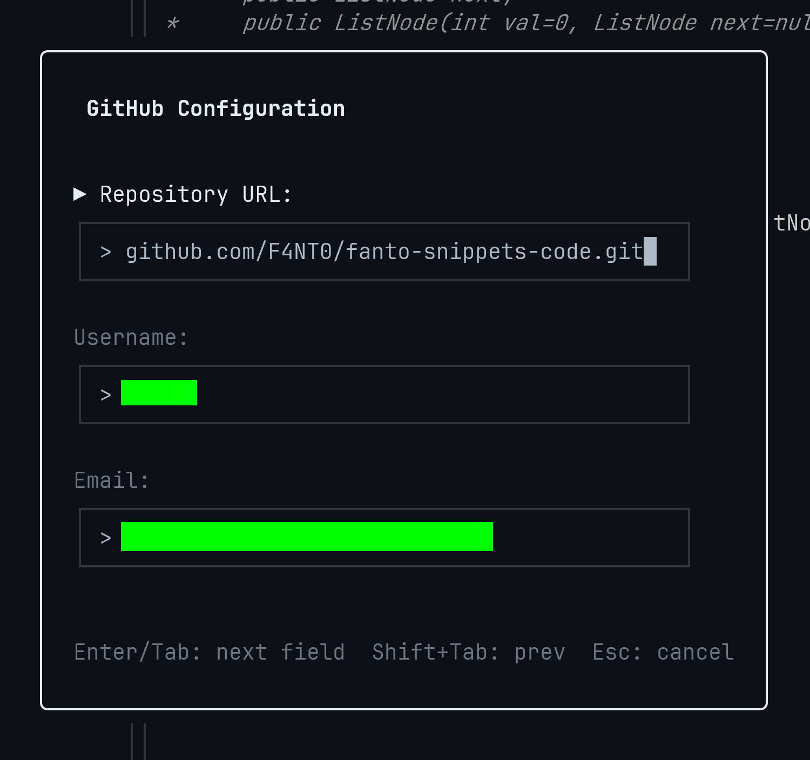
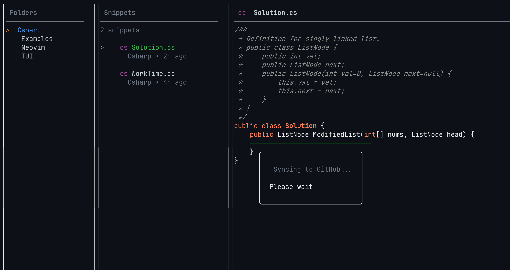
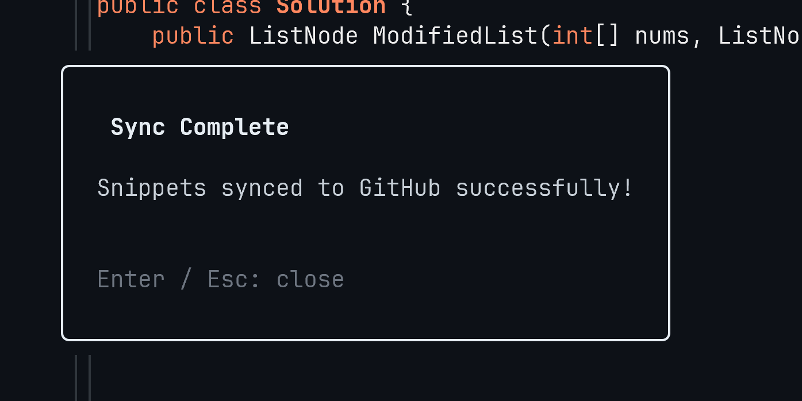

<div align="center">



**A terminal-native snippet manager built with Go**

[](https://go.dev)
[](https://www.microsoft.com/windows)
[](https://learn.microsoft.com/powershell)
[](https://neovim.io)
[](LICENSE)

Organize, preview, and edit code snippets in a three-panel TUI — with syntax highlighting, GitHub sync, and Windows-native file import.

<!-- Screenshot placeholder -->
<!--  -->

</div>

---

## Table of Contents

- [Features](#features)
- [Requirements](#requirements)
- [Installation](#installation)
- [Interface](#interface)
- [Navigation](#navigation)
- [Snippets Management](#snippets-management)
- [Neovim Integration](#neovim-integration)
- [File Import](#file-import)
- [GitHub Sync](#github-sync)
- [Supported Languages](#supported-languages)
- [Project Structure](#project-structure)
- [Dependencies](#dependencies)

---

## Features

[](.)
[](.)
[](.)
[](.)
[](.)

- **Three-panel layout** — Folders / Snippets / Preview, fully keyboard-driven
- **Syntax highlighting** powered by [Chroma](https://github.com/alecthomas/chroma) with the GitHub Dark theme
- **Language badges** — each file shows its extension label in the official language color (e.g. `py` in Python blue, `cs` in C# purple)
- **Folder icons** — selected folder highlighted in blue
- **Inline file search** — press `/` in Snippets to filter files by name in real-time; supports glob patterns (`*.go`)
- **Preview word search** — press `/` in Preview to search for any word; press `Enter` to find all matches, `n`/`N` to cycle
- **Line numbers** — toggle line numbers in Preview with `L`; matched lines are highlighted
- **Contextual status bar** — hints change automatically based on which panel is active
- **Neovim editing** — opens in a new Windows Terminal tab; TUI stays alive while you edit
- **File import** — native Windows file picker to copy any file into the current folder
- **Delete with confirmation** — press `d` to delete the selected file; a modal asks for confirmation before removing
- **Move between folders** — press `m` to move a snippet to another folder with an interactive picker modal
- **Snippets directory info** — press `o` to see the current snippets path, open it in Explorer, or switch to a different directory
- **GitHub sync** — push your snippets to a remote repository with a single key press
- **TUI Installer** — run `clidocs-install.exe` to add `clidocs` to PATH and create the `clidoc` PowerShell alias automatically
- **Dark theme** — unified `#0d1117` background throughout, GitHub-inspired palette

---

## Requirements

[](https://go.dev/dl)
[](https://neovim.io)
[](https://aka.ms/terminal)
[](https://git-scm.com)

| Requirement | Notes |
|---|---|
| **Go 1.24+** | To build from source |
| **Windows 11 + PowerShell** | Primary supported platform |
| **Neovim (`nvim`)** | Must be in `PATH` to edit files |
| **Windows Terminal (`wt`)** | Recommended — editor opens in a new tab |
| **Git** | Required for the GitHub sync feature |
| **JetBrains Nerd Font** (or any Nerd Font) | For folder icons in the terminal |

---

## Installation

```powershell
# Clone the repository
git clone https://github.com/your-username/clidocs.git
cd clidocs

# Build
go build -o clidocs.exe .

# Run
.\clidocs.exe
```

**Add to PATH permanently:**

```powershell
Copy-Item .\clidocs.exe "$env:USERPROFILE\AppData\Local\Microsoft\WindowsApps\clidocs.exe"
```

After that, open any PowerShell window and type `clidocs`.

> **Snippets are stored in:** `%USERPROFILE%\clidocs_snippets\`  
> The directory is created automatically on first run. Each sub-folder becomes a category in the Folders panel.

---

## Interface

<div align="center">

</div>

### Panel descriptions

| Panel | Description |
|---|---|
| **Folders** | Categories for your snippets. Selected folder shown in blue with `>` arrow in orange. Folder icon `` shown next to each name. |
| **Snippets** | Files inside the selected folder. Selected file shown in green with `>` cursor in orange. Extension badge colored by language. |
| **Preview** | Syntax-highlighted content of the selected file. Scrollable. Header shows the file's extension badge and name. |

---

## Navigation

### Folders panel

| Key | Action |
|---|---|
| `↑` / `k` | Previous folder |
| `↓` / `j` | Next folder |
| `Enter` / `→` | Open folder, move focus to Snippets |
| `n` | Create new folder |
| `o` | Snippets directory info |
| `Tab` / `→` | Next panel |
| `q` / `Ctrl+C` | Quit |

### Snippets panel

| Key | Action |
|---|---|
| `↑` / `k` | Previous file |
| `↓` / `j` | Next file |
| `Enter` | Open selected file in Neovim |
| `/` | **Inline search** — filter files by name |
| `n` | Create new file |
| `m` | Move file to another folder |
| `c` | Import file from Windows file picker |
| `d` | Delete selected file (with confirmation) |
| `r` | Reload files and preview |
| `Tab` | Next panel |

#### Inline search mode (`/` in Snippets)

| Key | Action |
|---|---|
| Type | Filter files in real-time (supports `*.go` glob) |
| `↑` / `↓` | Navigate filtered results (preview updates live) |
| `Enter` | Confirm selection, exit search — file stays selected |
| `Esc` | Cancel search, restore full list |

### Preview panel

| Key | Action |
|---|---|
| `↑` / `k` | Scroll up |
| `↓` / `j` | Scroll down |
| `L` | Toggle line numbers |
| `/` | **Word search** in current file |
| `Tab` | Next panel |
| `q` / `Ctrl+C` | Quit |

#### Preview word search mode (`/` in Preview)

| Key | Action |
|---|---|
| Type | Enter search term |
| `Enter` | Find all matches — matched lines highlighted |
| `n` | Jump to next match |
| `N` | Jump to previous match |
| `Esc` | Close search |

### Global

| Key | Action |
|---|---|
| `Tab` / `→` / `←` | Switch panels |
| `s` | Jump to Folders panel |
| `g` | Sync to GitHub |
| `G` | Edit GitHub config |
| `o` | Snippets directory info |
| `r` | Reload |
| `q` / `Ctrl+C` | Quit |

---

## Snippets Management

### Inline File Search

1. Focus the **Snippets** panel
2. Press `/` — the title bar changes to a search input `/ query█`
3. Type to filter: matches update instantly
   - `docker` → any filename containing *docker*
   - `*.go` → all Go files (glob)
   - `main.go` → exact match
4. Use `↑`/`↓` to navigate — **preview updates live** as you move
5. Press `Enter` to confirm selection (stays on that file, no editor opens)
6. Press `Esc` to cancel and restore the full list

<div align="center">

</div>

### Preview Word Search

1. Focus the **Preview** panel
2. Press `/` — a search bar appears below the file title
3. Type the word or phrase you want to find
4. Press `Enter` — all matching lines are highlighted:
   - **Orange `▶`** — current hit (focused match)
   - **Green `•`** — other matches
5. Press `n` / `N` to cycle forward/backward through hits
6. The view auto-scrolls to keep the current hit visible
7. Press `Esc` to close the search bar

<div align="center">

</div>

### Line Numbers

Press `L` while the Preview panel is active to toggle line numbers on/off.
When line numbers are enabled, matched lines show their number in orange (current) or green (other hits).

<div align="center">

</div>

### Create a folder

1. Focus the **Folders** panel
2. Press `n`
3. Type the folder name → `Enter` to confirm, `Esc` to cancel

<div align="center">

</div>

### Create a file

1. Focus the **Snippets** panel (with a folder selected)
2. Press `n`
3. **Step 1** — Enter the file name (without extension) → `Enter` or `Tab`
4. **Step 2** — Enter the extension (e.g. `go`, `py`, `md`) → `Enter` to create and open

<div align="center">

</div>

### Delete a file

1. Focus the **Snippets** panel and navigate to the file
2. Press `d`
3. A confirmation modal shows the filename — press `Enter` or `y` to delete, `Esc` or `n` to cancel
4. On deletion, the file list reloads and a status message appears for 3 seconds

> **Warning:** Deletion is permanent — the file is removed from disk immediately.

<div align="center">

</div>

### Move a file to another folder

1. Focus the **Snippets** panel and navigate to the file
2. Press `m` (requires at least 2 folders)
3. A modal opens listing all other folders — navigate with `↑↓`
4. Press `Enter` to move the file; the list reloads automatically

<div align="center">

</div>

---

## Snippets Directory

Press `o` from any panel to open the directory info modal:

```
 Snippets Directory

C:\Users\You\clidocs_snippets
────────────────────────────────────────────
Enter: open in Explorer   s: change directory   Esc: close
```

| Action | Description |
|---|---|
| `Enter` | Opens the snippets folder in Windows Explorer |
| `s` | Opens a native folder picker to choose a new snippets directory |
| `Esc` | Closes the modal |

> Changing the directory takes effect immediately — clidocs reloads with the new root. The original default directory (`%USERPROFILE%\clidocs_snippets`) is not deleted.

<div align="center">

</div>

---

## Neovim Integration

[](.)

When you press `Enter` on a file, clidocs shows a confirmation modal then opens a **new Windows Terminal window** with Neovim:

```
 Open in Neovim

 md  Comments.md
──────────────────────────────────────────────
 Opens Neovim in a new Windows Terminal window.

1. Edit your file in Neovim
2. Save and exit Neovim   :wq
3. Close the terminal tab  exit
4. Back here, press        r  to reload preview

Enter: open editor  Esc: cancel
```

> **Fallback:** If Windows Terminal (`wt`) is not available, Neovim takes over the current terminal and returns to clidocs on exit.

<div align="center">

</div>

---

## File Import

[](.)

Copy any file from your computer into the currently selected folder:

1. Focus the **Snippets** panel
2. Press `c`
3. A native Windows **Open File dialog** appears
4. Select one or more files → click Open
5. Files are copied into the current folder; the list reloads automatically

> Supports **multi-selection** — hold `Ctrl` or `Shift` in the dialog to select multiple files.

<div align="center">

</div>

---

## GitHub Sync

[](.)

Back up and share your snippets by syncing to a GitHub repository.

### First use

Press `g` — a setup modal appears asking for:

| Field | Example |
|---|---|
| **Repository URL** | `https://github.com/user/snippets.git` |
| **Username** | `your-github-username` |
| **Email** | `you@example.com` |

Navigate fields with `Enter` or `Tab` / `Shift+Tab`. On confirm, the config is saved to `clidocs_snippets/.clidocs_git.json` and an initial sync runs.

### How sync works

1. `git init` (first time only)
2. Checks if the remote already has commits → pulls first to avoid conflicts
3. `git add -A` → `git commit` → `git push -u origin main`
4. Shows a success or error modal with the result

### Change configuration

Press `G` to open the configuration modal at any time and update the repo URL, username, or email.

<div align="center">

</div>

### Git indicator

When connected, the header shows `  <username>` confirming the active GitHub configuration.

> **Note:** The repository must exist on GitHub before syncing. For private repos, ensure credentials are cached via [Git Credential Manager](https://github.com/git-ecosystem/git-credential-manager) or SSH.

<div align="center">

</div>

<div align="center">

</div>

---

## Supported Languages

Syntax highlighting uses **Chroma** with the **GitHub Dark** theme. Each file shows a colored extension badge.

| Extension | Language | Badge color |
|---|---|---|
| `.go` | Go |  |
| `.py` | Python |  |
| `.ts` | TypeScript |  |
| `.js` | JavaScript |  |
| `.tsx` / `.jsx` | React |  |
| `.rs` | Rust |  |
| `.cs` | C# |  |
| `.cpp` / `.cc` | C++ |  |
| `.c` / `.h` | C |  |
| `.java` | Java |  |
| `.kt` | Kotlin |  |
| `.swift` | Swift |  |
| `.sh` / `.bash` | Shell |  |
| `.ps1` | PowerShell |  |
| `.rb` | Ruby |  |
| `.php` | PHP |  |
| `.vue` | Vue |  |
| `.svelte` | Svelte |  |
| `.dart` | Dart |  |
| `.md` | Markdown |  |
| `.html` | HTML |  |
| `.css` | CSS |  |
| `.scss` | SCSS |  |
| `.json` | JSON |  |
| `.yaml` / `.yml` | YAML |  |
| `.toml` | TOML |  |
| `.sql` | SQL |  |
| `.xml` | XML |  |
| `.lua` | Lua |  |
| `.tf` / `.hcl` | Terraform |  |
| `.r` | R |  |
| `.ex` / `.exs` | Elixir |  |
| `.vim` | Vim Script |  |
| `.env` | Dotenv |  |
| `.txt` / `.conf` | Plain text |  |

---

## Project Structure

| File | Description |
|---|---|
| `main.go` | Entry point — creates snippets dir and starts Bubbletea |
| `dirs.go` | Resolves `%USERPROFILE%\clidocs_snippets` path |
| `model.go` | App state struct, folder/file loading, message types |
| `update.go` | All keyboard handling, modal state machine, editor/sync launch |
| `view.go` | Three-panel layout, modal overlays, status bar renderer |
| `styles.go` | All Lipgloss styles — GitHub Dark color palette |
| `icons.go` | Extension → label + color mapping; Chroma lexer lookup |
| `highlight.go` | Chroma syntax highlighting engine |
| `gitconfig.go` | Load/save `.clidocs_git.json` configuration |
| `gitsync.go` | Git CLI operations (init, pull, add, commit, push) |
| `filecopy.go` | Windows file picker via PowerShell + file copy logic |

---

## Dependencies

[](https://github.com/charmbracelet/bubbletea)
[](https://github.com/charmbracelet/lipgloss)
[](https://github.com/alecthomas/chroma)

| Package | Purpose |
|---|---|
| `github.com/charmbracelet/bubbletea` | TUI framework (Elm architecture) |
| `github.com/charmbracelet/bubbles` | Text input component |
| `github.com/charmbracelet/lipgloss` | Layout and styling |
| `github.com/alecthomas/chroma/v2` | Syntax highlighting |

---

<div align="center">

Made with ☕ and Go · Dark theme · Keyboard-first

</div>
